# Rock Paper Scissors
(Author : Mohammad Abdullah Hamza)

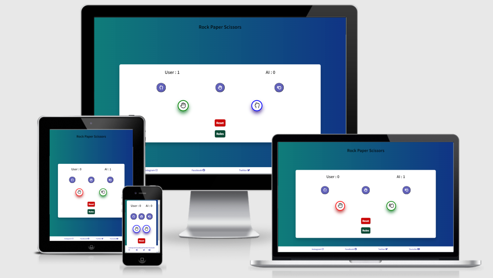

[Live webpage](https://ahamza98.github.io/rock-paper-scissors/)

#
## Project Goals 
The goal of this project was to create a simple rock, paper, scissors game against AI. If you win a round you get a point, if you lose, AI gets a point.

### User Goals
- Play a quick game of Rock Paper and Scissors on the go.
- Try to compete with AI and predict its moves

### Site Owner Goals
- Fully responsive game for all devices
- Customers play a quick game and have a little fun.

## User Experience

### Target Audience
- For all ages
- Anyone that wants to play a quick game for a few minutes

### User Stories
- As a user I want to :
1. Compete against AI.
2. Be able to predict AI's next move based on the previous.
3. Get a clear message or sign if i won a round.
4. Scores to be incremented correctly.
5. Play again
6. Know the rules of the game

### Site Owner Stories
1. Customers to enjoy the game
2. Reach us on social media

#
## Design

### Colour Choices
- The colur choices were chosen to be bright and colourful like red, blue and green to denote excitement.
- Also have used linear-gradient for background colors to make it less plain and more eye-catching

### Fonts
- Fonts have been imported from Google fonts.
- The font that has been used throughout the website is **Source Sans Pro**.

### Icons and Favicons
- The favicon is a image of a controller taken from a free website called [Pixabay](https://pixabay.com/vectors/controller-pad-video-game-1294077/)
- [Fontawesome](https://fontawesome.com/) was used for the rock, paper and scissor buttons.

### Wireframes

Browser Open

- This is how the browser will look when it is started. Scores are at 0. 3 buttons for choices, as well as a reset and rules button

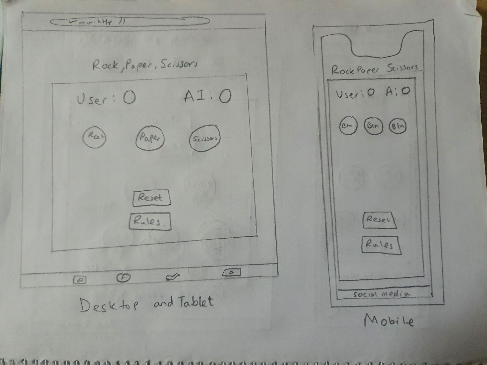

Game Mode

- When the choice button is clicked, scores will be incremented for winners, or stay the same if it is a tie. A visual represantation of the choices will be shown below the buttons.

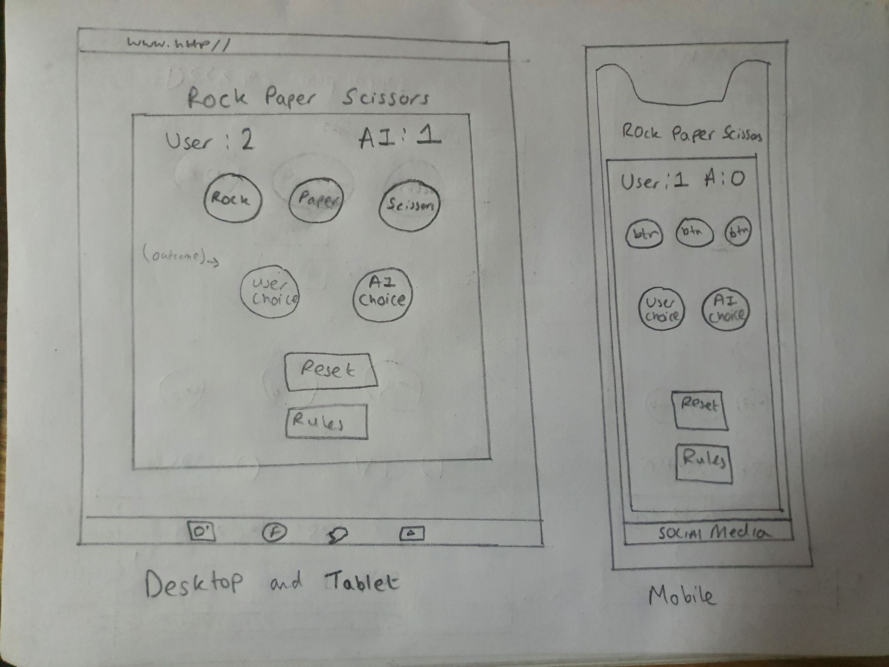

Rules Modal

- When the rules button is clicked, a modal will pop out of the rules

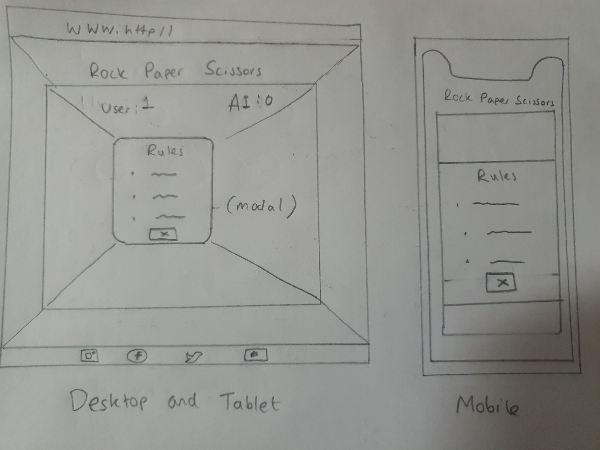

#
#
## Features
This website consists of one page and 5 features.

Start Screen

- When website is opened and when reset button is pressed.
- Scores are a default zero.
- 3 buttons for choices
- Rules button that opens a modal
- Reset button that resets the score

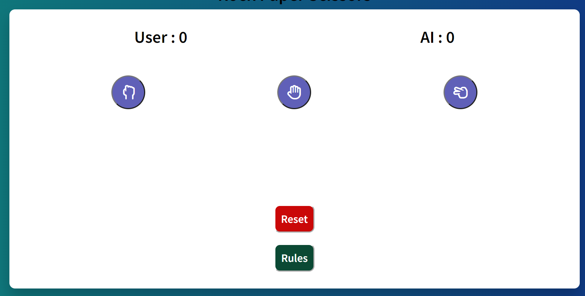

Header

- The Header is very simple to reflect the simplicity of the game

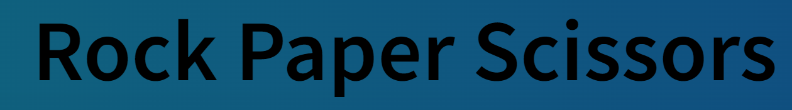

Button Choices

- The user has 3 button to choose from, Rock, Paper or Scissors. The buttons change colour when hovered on

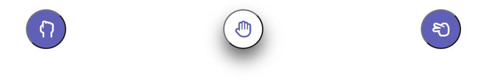

Game Start

- Scores Increment if user or AI wins. A visual represantation is shown below of user and AI choices. Green border will be wrapped around the winner, red around the loser and blue for both when there is a tie.

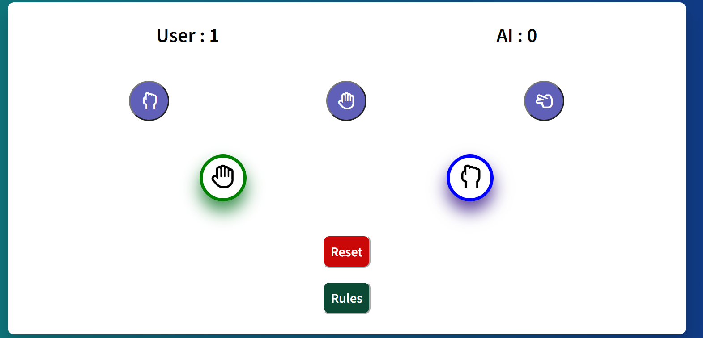

Rules Modal

- When the rules button is clicked, a modal will pop up with a cross **X** to close it.

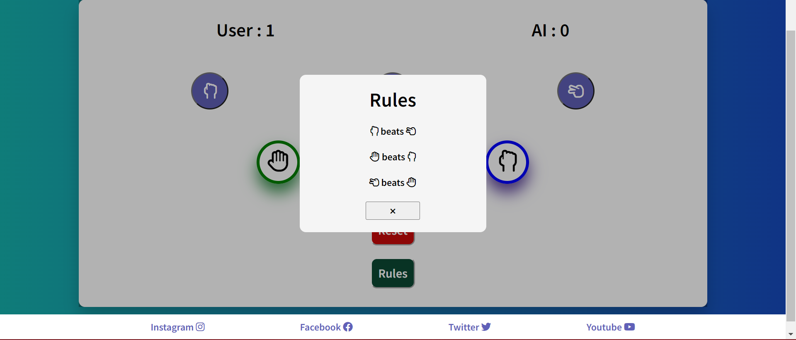

Footer

- Finally a footer of the social media platforms.

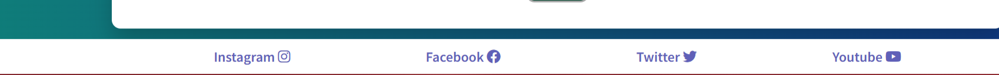

#
#
## Technologies Used

### Languages
- HTML
- CSS
- JavaScript

### Frameworks & Tools
- Git
- GitHub
- Gitpod
- VS code editor
- Font Awesome
- Pixabay
- Lighthouse
- W3C Markup validation service
- W3C Jigsaw CSS validation service 
- WAVE WebAIM web accessibility evaluation tool

#
#
## Validation, Accessibility and Performance
### Validation
Website used for HTML and CSS validation: [W3C](https://www.w3.org/)  

HTML Validation

- No errors  

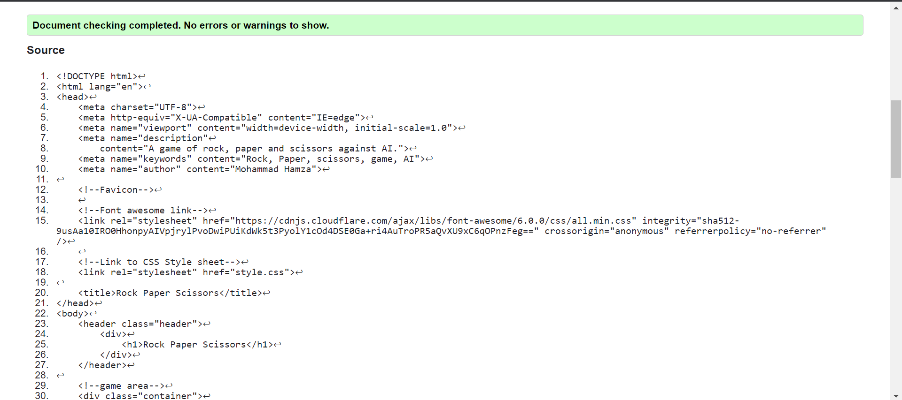

  

CSS Validation

- No errors  

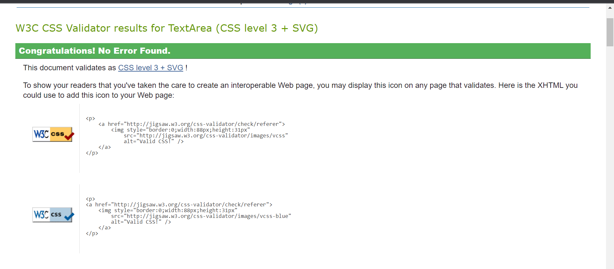

  

### Accessibility
Website used to check accessibility of the page: [Wave WebAIM](https://wave.webaim.org/)  

- No errors or contrast errors.
- Alert on the result section, as the paragraph element, seems to be a heading element. But I chose  the paragraph element so the text will not come out too big.  

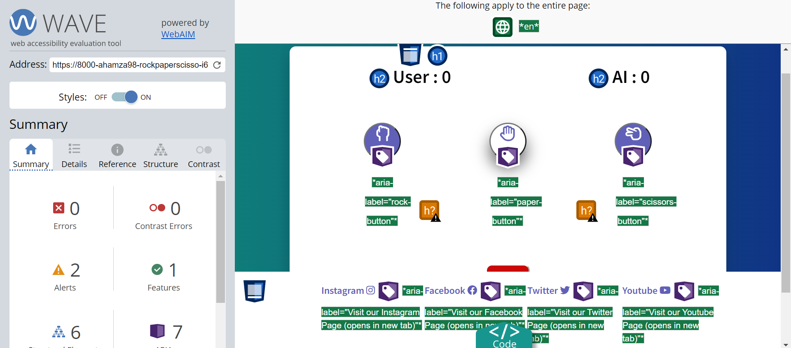
  

 ### Performance
Google Chrome Lighthouse is a built in software to check the performance, accebility and search engine optimization.  

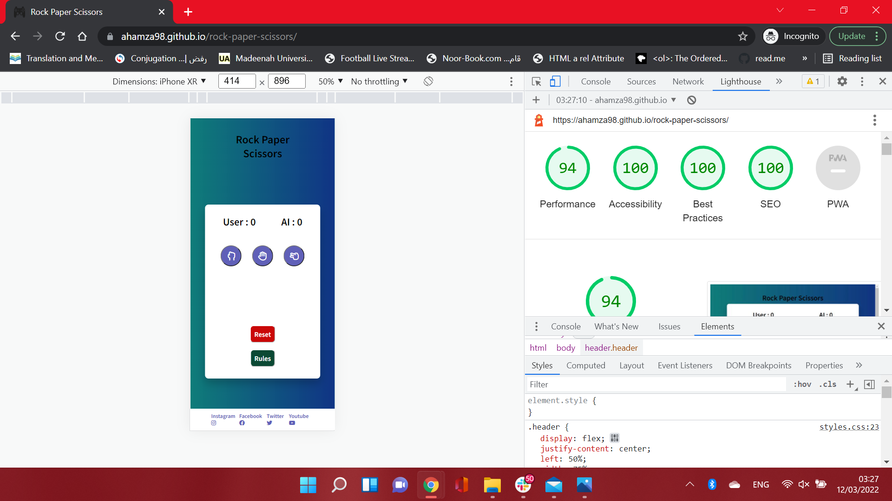

#
#
## Testing
### Device Testing
This website was tested on the following devices:
- Lenovo Ideapad c340
- Ipad mini
- Samsung Galaxy S10

### Browser Testing
This website was tested on the following browsers:
- Google Chrome
- Mozilla firefox
- Samsung Internet
#
#
## Bugs
Some bug issues I faced were:
1. Making the game container compatible for smaller devices.
  Solution: Set width in smaller screen sizes to 90% to 100%.
2. The modal was extending the page in the x-axis and away from the main screen area.  
Solution: set overflow x : hidden, and set the modal container height and width to 100%.
3. In the results area, where the choices are visually displayed, the borders would stay on blue, and not change.  
Solution: remove the classList('blue-border') that changes the border color in Javascript area.
4. Favicon error on console.  
Solution: Add a favicon to the website.

## Deployment
* This site was deployed to the Github pages, the steps to deploy:
  * On the Github reprository page, click on settings
  * Go down and click on pages
  * From the source drop-down menu click on Main.
  * Save your reprository
  * From there on the reprository will be saved and uploaded to the server.
  * After refreshing it will say your site is published at https://ahamza98.github.io/rock-paper-scissors/

